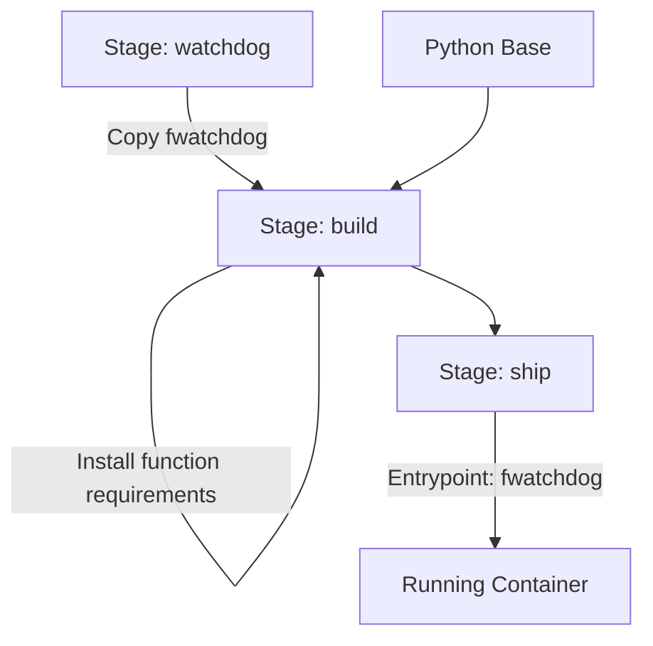

# Python Function Dockerization Guide

This guide explains how to create a Docker image for a Python function, details the handler function interface, and provides examples for both modern asynchronous (FastAPI-style) and traditional synchronous (Flask-style) implementations.

## Introduction

The Rafay Python function template is designed to provide a seamless way to deploy Python code as a serverless-style function. It has evolved from a Flask-based synchronous model to a FastAPI-based asynchronous model, while maintaining full backward compatibility for synchronous handlers.

## The Handler Function Interface

The core of your function is the `handle` function, typically defined in `handler.py`.

### Signature

```python
async def handle(logger: Logger, request: Dict[str, Any]) -> Dict[str, Any]:
    # ... your code ...
```

- **`logger`**: A standard Python `Logger` object (or an extended `ActivityLogger`) used for logging. Logs are captured and can be viewed in the Rafay console.
- **`request`**: A dictionary containing the input payload and metadata injected by the SDK.

### Request Object Structure

The `request` object is a Python dictionary that contains both the user-provided JSON payload and a `metadata` field with context about the execution environment.

```json
{
    "metadata": {
        "activityID": "...",      // Unique ID for the current execution
        "environmentID": "...",   // ID of the Rafay environment
        "environmentName": "...", // Name of the Rafay environment
        "organizationID": "...",  // ID of the organization
        "projectID": "...",       // ID of the project
        "stateStoreUrl": "...",   // URL for the state management API
        "stateStoreToken": "..."  // Token for authenticating with the state store
    },
    "key1": "value1",             // Your inputs
    "key2": "value2"
}
```

You can access these fields directly in your handler:

```python
def handle(logger, request):
    project_id = request.get("metadata", {}).get("projectID")
    logger.info(f"Executing in project: {project_id}")
    # ...
```

- **Return Value**: A dictionary that will be returned as the JSON response body.

### Modern Async Handlers (FastAPI-style)

Modern handlers use `async def`. This is preferred for I/O-bound tasks (like calling external APIs or databases) as it allows the server to handle multiple requests concurrently without blocking.

```python
import asyncio
import httpx
from logging import Logger
from typing import Dict, Any

async def handle(logger: Logger, request: Dict[str, Any]) -> Dict[str, Any]:
    logger.info("Starting your request")
    
    # Example: Using the request object to get a URL from input
    target_url = request.get("url", "https://api.github.com")
    
    # Example: Non-blocking HTTP call using httpx
    async with httpx.AsyncClient() as client:
        response = await client.get(target_url)
        data = response.json()
    
    return {
        "status": "success",
        "url_accessed": target_url,
        "github_url": data.get("current_user_url")
    }
```

### Sync Handlers (Backward Compatible)

If you have existing code or prefer a synchronous style, you can define the handler without `async`. The SDK automatically detects this and runs the handler in a thread pool to avoid blocking the main event loop.

```python
import requests
from logging import Logger
from typing import Dict, Any

def handle(logger: Logger, request: Dict[str, Any]) -> Dict[str, Any]:
    logger.info("Starting your request")
    
    # Example: Using the request object to get a URL from input
    target_url = request.get("url", "https://api.github.com")
    
    # Example: Blocking HTTP call using requests
    response = requests.get(target_url)
    data = response.json()
    
    return {
        "status": "success",
        "url_accessed": target_url,
        "github_url": data.get("current_user_url")
    }
```

## Project Structure

The function repository follows a structure to separate the server logic from your function logic. When you create a new function, you can have any structure in your repository.

```text
templates/python/
├── Dockerfile              # Multi-stage Docker build file
├── main.py                 # Entry point that starts the SDK server
├── requirements.txt        # Root dependencies (SDK, FastAPI, etc.)
└── function/               # Your function code goes here
    ├── __init__.py
    ├── handler.py          # Your handle() function implementation
    ├── requirements.txt    # Dependencies specific to your function
    └── utils.py            # (Optional) Add your own modules
```

### Adding Custom Modules

You are not limited to `handler.py`. You can add your own Python files and directories within the `function/` folder to organize your code. For example, if you create a `function/utils.py` file:

**`function/utils.py`**:
```python
def format_message(name: str) -> str:
    return f"Hello, {name}!"
```

**`function/handler.py`**:
```python
from . import utils  # Import your custom module

def handle(logger, request):
    name = request.get("name", "World")
    message = utils.format_message(name)
    return {"message": message}
```

## Dependency Management

There are two `requirements.txt` files:

1.  **`./requirements.txt`** (Root): This file contains the core dependencies required to run the function server and the Rafay SDK.
    *   **SDK Versioning**:
        *   **`0.0.32` (or later)**: Uses **FastAPI** as the underlying server. This is the recommended version for modern, asynchronous handlers.
        *   **`0.0.30`**: Uses **Flask** as the underlying server. Use this only if you have strict requirements for the older Flask-based environment.
        *   **`0.0.31`**: **DEPRECATED and BROKEN**. Do not use this version.
2.  **`./function/requirements.txt`**: This is where you should add any third-party packages required by your function logic (e.g., `requests`, `pandas`, `boto3`). The Docker build process installs these separately to optimize layer caching.

For example, to use `requests` in your handler, add it to `function/requirements.txt`:

Note: You can also combine requirements.txt into one file and dump all the dependencies in it.

```text
requests==2.31.0
```

## Docker Image Construction

The provided `Dockerfile` uses a multi-stage build process to create a secure, optimized image.

### Key Components

1.  **Watchdog (`of-watchdog`)**: The image uses `of-watchdog` as an entrypoint. It manages the HTTP server and routes requests to your Python process.
2.  **Base Image**: Typically uses `python:3.11-slim-bullseye` for a small footprint.
3.  **Dependency Management**:
    *   `requirements.txt` (root): Contains SDK and server-level dependencies.
    *   `function/requirements.txt`: Contains dependencies specific to your function logic.
4.  **Security**: Runs as a non-root user (`app`).

### Dockerfile Content

Below is the standard `Dockerfile` used for Python functions. Note the comments on how to simplify it if you only use a single `requirements.txt` file.

```dockerfile
ARG WATCHDOG_IMAGE_REPO=ghcr.io/openfaas/of-watchdog
ARG WATCHDOG_IMAGE_TAG=0.10.6
ARG PYTHON_IMAGE_REPO=python
ARG PYTHON_IMAGE_TAG=3.11-slim-bullseye

FROM --platform=${TARGETPLATFORM:-linux/amd64} ${WATCHDOG_IMAGE_REPO}:${WATCHDOG_IMAGE_TAG} AS watchdog
FROM --platform=${TARGETPLATFORM:-linux/amd64} ${PYTHON_IMAGE_REPO}:${PYTHON_IMAGE_TAG} AS build

COPY --from=watchdog /fwatchdog /usr/bin/fwatchdog
RUN chmod +x /usr/bin/fwatchdog

ARG ADDITIONAL_PACKAGE=""
RUN apt-get -qy update \
    && apt-get -qy install ${ADDITIONAL_PACKAGE} \
    && rm -rf /var/lib/apt/lists/*

# Add non root user
RUN addgroup --system app && adduser app --system --ingroup app
RUN chown app /home/app

USER app
ENV PATH=$PATH:/home/app/.local/bin
WORKDIR /home/app/

ARG PROXY=""

# Install root requirements
COPY --chown=app:app main.py           .
COPY --chown=app:app requirements.txt   .
USER root
RUN pip install --no-cache-dir --proxy=${PROXY} -r requirements.txt
USER app

# --- START: Function-specific dependencies ---
# If you prefer to use only the root requirements.txt, 
# you can remove or comment out the following lines.
RUN mkdir -p function
RUN touch ./function/__init__.py
WORKDIR /home/app/function/
COPY --chown=app:app function/requirements.txt	.
RUN pip install --no-cache-dir --proxy=${PROXY} --user -r requirements.txt
# --- END: Function-specific dependencies ---

USER root
COPY --chown=app:app function/   .

FROM build AS ship
WORKDIR /home/app/
USER app

# Set up of-watchdog for HTTP mode
ENV fprocess="python main.py"
ENV cgi_headers="true"
ENV mode="http"
ENV upstream_url="http://127.0.0.1:5000"
ENV ready_path="/_/ready"
ENV exec_timeout="0"
ENV read_timeout="3600"
ENV write_timeout="3600"
ENV healthcheck_interval="30"
ENV GUNICORN_WORKERS="4"
ENV GUNICORN_THREADS="2"

HEALTHCHECK --interval=5s CMD [ -e /tmp/.lock ] || exit 1

CMD ["fwatchdog"]
```

### Multi-stage Build Flow



## Building and Running

### Build the Image

From the root of your function directory:

```bash
docker build -t my-python-function:latest .
```

### Environment Variables

- `fprocess`: The command to start your Python server (default: `python main.py`).
- `GUNICORN_WORKERS`: Number of worker processes (default: CPU count).
- `GUNICORN_THREADS`: Number of threads per worker (default: 2).
- `MAX_WORKERS`: Maximum workers for the sync handler thread pool (default: 50).
